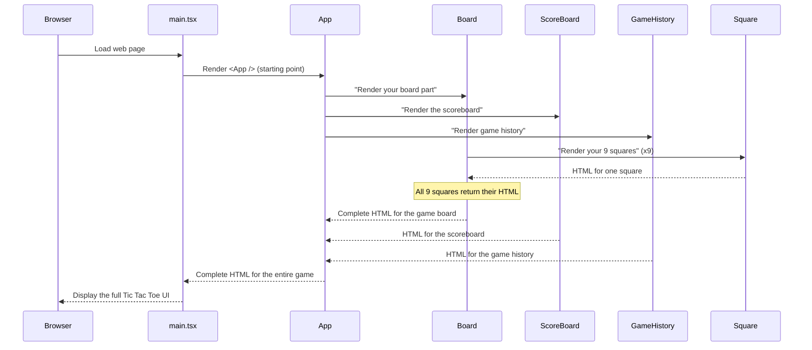

# Chapter 1: React Application UI Components

Imagine you're building a magnificent house, but instead of using giant, unwieldy walls and roofs, you're building it with perfectly designed LEGO bricks. Each brick has a specific purpose: a window piece, a door piece, a roof piece, and so on. This makes building much easier because you can focus on one small part at a time and then snap them all together to form the complete house.

In our **SecureFlow** project, we're building a Tic Tac Toe game. Just like building a house with LEGO, we don't build the entire game interface as one giant piece. Instead, we break it down into smaller, manageable "LEGO bricks" called **React components**.

The problem these components solve is simple: how do we create a complex, interactive user interface (UI) without getting completely lost in a sea of code? React components provide an elegant solution by allowing us to build our UI out of independent, reusable pieces. For our Tic Tac Toe game, this means we'll have components for the game board itself, for showing scores, and even for tracking game history.

---

### What are React Components? Your UI's LEGO Bricks

At its heart, a React component is like a small, self-contained piece of your user interface. It's usually a JavaScript function that describes what a part of your UI should look like. Think of it as a blueprint for a specific type of LEGO brick.

Let's look at the smallest brick in our Tic Tac Toe game: a single square on the board.

```typescript
// src/components/Square.tsx (Simplified)
import React from 'react';

// This describes the "information" a Square component needs
interface SquareProps {
  value: string | null; // Can be 'X', 'O', or empty (null)
  onClick: () => void;  // A function to run when the square is clicked
  // ... other details like styling
}

// This is our Square component, a functional LEGO brick
const Square: React.FC<SquareProps> = ({ value, onClick }) => {
  return (
    <button
      className="button-style" // Imagine this applies some visual styling
      onClick={onClick}        // When clicked, it calls the function given to it
    >
      {value}                  {/* It displays 'X', 'O', or nothing */}
    </button>
  );
};

export default Square;
```

**Explanation**: This `Square` component is a simple button. It takes two main pieces of information (we call these **props**, short for properties):
1.  `value`: What should be displayed inside the square (`'X'`, `'O'`, or empty).
2.  `onClick`: A special instruction (a function) that tells the square what to do when a player clicks on it.

When you see `<Square value="X" onClick={myFunction} />` in your code, you're essentially telling React: "Hey, put a `Square` brick here, show 'X' inside it, and when someone clicks it, run `myFunction`!"

---

### Our Tic Tac Toe Components: The Complete LEGO Box

Our Tic Tac Toe game is built from several specialized components, each handling a different part of the user interface:

| Component Name  | What it is (Analogy)       | What it does for Tic Tac Toe                                  |
| :-------------- | :------------------------- | :------------------------------------------------------------ |
| `Square`        | A single LEGO stud         | Displays 'X', 'O', or empty; responds to clicks               |
| `Board`         | A 3x3 LEGO baseplate       | Arranges and manages 9 `Square` components in a grid          |
| `ScoreBoard`    | A LEGO scoreboard          | Displays current scores for Player X, Player O, and draws     |
| `GameHistory`   | A LEGO activity log        | Shows a list of past game results (who won or if it was a draw) |
| `App`           | The main house blueprint   | The central component that brings all other components together to form the complete game interface |

---

### The Main Blueprint: `App.tsx`

The `App.tsx` file is the master blueprint that organizes all our smaller components into one complete Tic Tac Toe game. It's like the main assembly line where all your LEGO sections are brought together. It doesn't build the squares or the scoreboard itself; instead, it uses the components we defined earlier.

```typescript
// src/App.tsx (Simplified)
import React from 'react';
import Board from './components/Board';           // Our board component
import ScoreBoard from './components/ScoreBoard'; // Our scoreboard component
import GameHistory from './components/GameHistory'; // Our game history component

function App() {
  // ... (Lots of game logic and state will be here, but we'll cover that
  // in Chapter 2: Game Logic Engine) ...

  return (
    <div className="game-container"> {/* This is the overall layout */}
      <h1>Welcome to Tic Tac Toe!</h1>
      <div className="game-area">
        {/* We use our Board component here */}
        <Board /* ... some information goes here as props ... */ />
      </div>
      <div className="sidebar-area">
        {/* We use our ScoreBoard component here */}
        <ScoreBoard /* ... some information goes here as props ... */ />
        {/* We use our GameHistory component here */}
        <GameHistory /* ... some information goes here as props ... */ />
      </div>
    </div>
  );
}

export default App;
```

**Explanation**: Notice how `App.tsx` imports `Board`, `ScoreBoard`, and `GameHistory`. Then, in its `return` statement, it uses them like HTML tags: `<Board />`, `<ScoreBoard />`, `<GameHistory />`. This is how we "snap" our LEGO bricks together to build the complete UI. The `App` component is responsible for the overall layout and managing the game's state (who's turn it is, what's on the board, scores, etc.), but it delegates the visual rendering of specific parts to its child components.

---

### Assembling the Board: `Board.tsx`

The `Board` component is like a special LEGO baseplate designed for our Tic Tac Toe game. Its job is to arrange 9 `Square` components neatly into a 3x3 grid. It doesn't know *what* to display in each square or *how* to handle a click; it just knows *where* each `Square` should go and passes along the specific `value` and `onClick` instructions for each one.

```typescript
// src/components/Board.tsx (Simplified)
import React from 'react';
import Square from './Square'; // We need our Square brick here!

interface BoardProps {
  squares: Array<string | null>; // An array representing what's in each of the 9 squares
  onClick: (i: number) => void;  // A function to call when any square is clicked
  // ... other details like winning line
}

const Board: React.FC<BoardProps> = ({ squares, onClick }) => {

  // A helper function to render a single square
  const renderSquare = (i: number) => {
    return (
      <Square
        value={squares[i]}         // Tell the Square what value to display (X, O, or null)
        onClick={() => onClick(i)} // Tell the Square what to do when clicked (call the Board's onClick, with its index)
      />
    );
  };

  return (
    <div className="grid grid-cols-3 gap-2"> {/* This creates a 3x3 grid layout */}
      {/* We loop 9 times to create 9 Square components */}
      {Array(9).fill(null).map((_, i) => (
        <div key={i}>
          {renderSquare(i)} {/* Here, we use our Square brick 9 times! */}
        </div>
      ))}
    </div>
  );
};

export default Board;
```

**Explanation**: The `Board` component iterates 9 times, and for each iteration, it creates a `Square` component using `renderSquare(i)`. It passes a unique `value` (from its `squares` array) and a specific `onClick` function (that tells the main game which square was clicked) to each `Square`. This is how the `Board` component effectively "builds" the game grid using our smaller `Square` bricks.

---

### Under the Hood: How Components Render

Let's trace what happens when your web browser loads our Tic Tac Toe game, and how these components come to life.

1.  **Start the Engine**: Your web browser loads the initial HTML page. This page has a special empty spot, typically a `<div id="root">`.
2.  **React Takes Over**: The `src/main.tsx` file is the entry point for our React application. It tells React: "Find that empty root spot, and render our main `<App />` component there."
3.  **App Assembly**: The `<App />` component starts to render. It looks at its blueprint and sees that it needs a `<Board />`, a `<ScoreBoard />`, and a `<GameHistory />`. So, it tells each of these child components: "Hey, render yourselves and tell me what you look like!"
4.  **Board Assembly**: The `<Board />` component receives its instructions. It then asks each of its 9 individual `<Square />` components to render themselves.
5.  **Individual Bricks Render**: Each `<Square />`, `<ScoreBoard />`, and `<GameHistory />` component generates the HTML-like code (called JSX) that describes its appearance. For instance, a `Square` might generate a `<button>` tag with an 'X' inside.
6.  **Snap Together**: React collects all this HTML-like code from the smallest components, combines them step-by-step back up the chain (`Square` to `Board`, then `Board`, `ScoreBoard`, `GameHistory` to `App`).
7.  **Display**: Finally, React takes the complete, assembled HTML structure for the entire game and injects it into that `<div id="root">` spot in your web page, making the Tic Tac Toe game visible to you!

Here's a simplified sequence of how components interact during rendering:



Let's look at the relevant code files one more time to connect the dots:

#### **1. `src/main.tsx` - The Starting Whistle**

```typescript
// src/main.tsx
import { createRoot } from 'react-dom/client';
import App from './App.tsx'; // Import our main "App" component
import './index.css'; // Global styles for the entire app

// Find the main "root" element in our HTML page
createRoot(document.getElementById('root')!).render(
  // Tell React to render our App component inside this root
  <App />
);
```

**Explanation**: This is the very first piece of our React application that runs. It finds a special `div` in your `index.html` file (with `id="root"`) and injects our entire `<App />` component there. Without `main.tsx`, nothing would show up!

#### **2. `src/App.tsx` - The Grand Orchestrator**

```typescript
// src/App.tsx (Key parts for UI structure)
import React from 'react';
import Board from './components/Board';
import ScoreBoard from './components/ScoreBoard';
import GameHistory from './components/GameHistory';
// ... other imports for game logic (covered in Chapter 2) ...

function App() {
  // ... state and game logic here ...

  return (
    <div className="main-app-layout">
      <h1 className="game-title">Tic Tac Toe</h1>
      <div className="game-and-stats-area">
        <div className="game-section">
          {/* This is where we use our Board component */}
          <Board
            squares={/* ... current board state ... */}
            onClick={/* ... function to handle clicks ... */}
            winningLine={/* ... info about winning squares ... */}
          />
        </div>
        <div className="stats-section">
          {/* Here we use our ScoreBoard and GameHistory components */}
          <ScoreBoard scores={/* ... current scores ... */} />
          <GameHistory history={/* ... list of past games ... */} />
        </div>
      </div>
    </div>
  );
}

export default App;
```

**Explanation**: `App.tsx` is where the magic of combining components happens. It's the highest-level UI component. It manages the overall data (the game state, scores, history) and passes parts of that data down to its child components (`Board`, `ScoreBoard`, `GameHistory`) through **props**.

#### **3. `src/components/Board.tsx` - The Grid Maker**

```typescript
// src/components/Board.tsx (Key parts for rendering squares)
import React from 'react';
import Square from './Square'; // We import our smallest UI brick

interface BoardProps {
  squares: Array<string | null>; // The data for each square
  onClick: (i: number) => void;  // The function to call when a square is clicked
  // ... other props ...
}

const Board: React.FC<BoardProps> = ({ squares, onClick }) => {
  const renderSquare = (i: number) => {
    return (
      <Square
        value={squares[i]}          // Pass the value for this specific square
        onClick={() => onClick(i)}  // Pass the click handler for this specific square
      />
    );
  };

  return (
    <div className="grid-container">
      {/* Loop 9 times to create 9 Square components */}
      {Array(9).fill(null).map((_, i) => (
        <div key={i}>
          {renderSquare(i)} {/* Each call creates one Square component */}
        </div>
      ))}
    </div>
  );
};

export default Board;
```

**Explanation**: The `Board` component doesn't hardcode 9 separate buttons. Instead, it uses a loop to dynamically create and render 9 `Square` components. This makes the code very efficient and easy to manage, even if our game board was much larger!

---

### Conclusion

In this chapter, we learned that React components are like individual LEGO bricks that help us build complex user interfaces in an organized and reusable way. We saw how `App.tsx` acts as the main blueprint, bringing together components like `Board`, `ScoreBoard`, and `GameHistory`. We also explored how `Board` itself uses multiple `Square` components to form the game grid. This modular approach makes our code easier to understand, maintain, and extend.

Now that you understand how our game's visual pieces are put together, let's dive into the brain of the operation: how the game actually *works* and determines winners.

[Next Chapter: Game Logic Engine](02_game_logic_engine_.md)

---