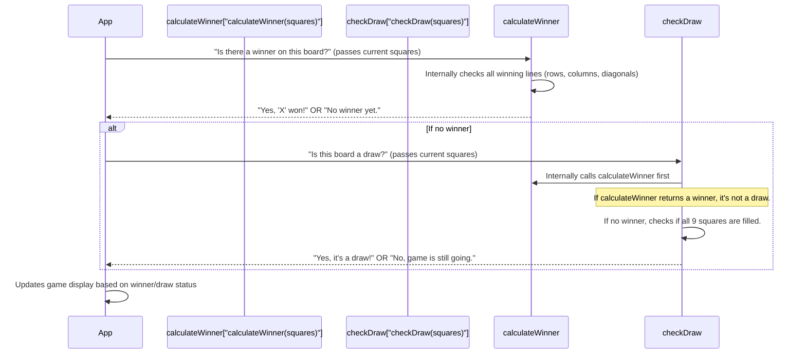

# Chapter 2: Game Logic Engine

In the previous chapter, [React Application UI Components](01_react_application_ui_components_.md), we learned how to build the visual parts of our Tic Tac Toe game using "LEGO bricks" called React components. We have the `Square` bricks, the `Board` baseplate, and even the `ScoreBoard` and `GameHistory` displays. These components are great at showing things to the player, but they don't actually *know* how to play the game. They're like the pretty parts of a robot that don't have a brain yet.

This is where the **Game Logic Engine** comes in!

### The Referee of Our Game: What Problem It Solves

Imagine you're playing a game of Tic Tac Toe with a friend. You draw the board, you take turns placing 'X's and 'O's. But who decides when someone wins? Who declares a draw? That's the **referee**. The referee knows all the rules and makes sure the game is fair and follows those rules.

In our **SecureFlow** project, the `Game Logic Engine` is exactly like that referee. Its job is to provide the intelligence for the game. It doesn't care if the 'X' is red or blue, or if the board is made of wood or plastic. It only cares about the **state of the game**: what's in each square, whose turn it is, and based on that, it decides if there's a winner or a draw.

The problem the `Game Logic Engine` solves is fundamental: **How do we make our Tic Tac Toe game actually *work* according to its rules, without cluttering our visual components with rule-checking code?** It provides the core intelligence to ensure the game functions correctly.

### Core Concepts: The Referee's Rulebook

Our `Game Logic Engine` has two main responsibilities, just like a referee:

1.  **Check for a Winner**: It needs to know how to look at the board and identify if any player (X or O) has managed to get three of their marks in a row – horizontally, vertically, or diagonally.
2.  **Check for a Draw**: If no one has won, it needs to check if all the squares are filled. If they are, and there's no winner, then the game is a draw.

It takes the current state of the game board as input and gives us the game's outcome as output.

### How to Ask the Referee: Using the Game Logic Engine

In our project, we have a special file called `src/utils/gameLogic.ts`. This file contains the JavaScript functions that act as our game's referee. The two main functions are:

*   `calculateWinner(squares)`: This function looks at the board (`squares`) and tells us if 'X' or 'O' has won, and which squares form the winning line.
*   `checkDraw(squares)`: This function looks at the board and tells us if the game has ended in a draw.

Let's see how our main application, `App.tsx` (which we saw in [React Application UI Components](01_react_application_ui_components_.md)), might use these functions.

```typescript
// Inside src/App.tsx (Simplified)
import { calculateWinner, checkDraw } from './utils/gameLogic'; // Import our referee functions

function App() {
  // ... Imagine 'currentSquares' holds the state of our 9 board squares
  const currentSquares = ['X', 'O', 'X', 'O', 'X', 'O', 'O', 'X', 'O']; // A full board, no winner

  // Ask the referee if there's a winner
  const winnerInfo = calculateWinner(currentSquares);

  // Ask the referee if it's a draw
  const isDraw = checkDraw(currentSquares);

  let status;
  if (winnerInfo) {
    status = `Winner: ${winnerInfo.winner}`;
  } else if (isDraw) {
    status = 'Result: Draw!';
  } else {
    status = 'Next player: X'; // Or O, depending on game state
  }

  return (
    <div>
      <p>{status}</p> {/* This will display "Result: Draw!" */}
      {/* ... The rest of your UI components ... */}
    </div>
  );
}
```

**Explanation**:
In this simplified example, our `App` component first gets the current state of the Tic Tac Toe board (an array of 9 values, like `['X', 'O', null, ...]` representing each square). Then, it calls `calculateWinner` to see if someone has won. If not, it calls `checkDraw` to see if all squares are filled without a winner. Based on the results, it updates the game status message.

### Under the Hood: How the Referee Makes Its Decisions

Let's peek behind the curtain to see how `calculateWinner` and `checkDraw` actually work.

#### Step-by-Step Decision Making:

When our `App` component asks the referee (`gameLogic.ts`) for a decision, here's a simplified sequence:



#### The `calculateWinner` Function

This function is the heart of the game logic. It defines all the ways a player can win.

```typescript
// src/utils/gameLogic.ts (Key parts of calculateWinner)
export function calculateWinner(squares: Array<string | null>) {
  // All possible winning combinations (rows, columns, diagonals)
  const lines = [
    [0, 1, 2], // Top row
    [3, 4, 5], // Middle row
    [6, 7, 8], // Bottom row
    [0, 3, 6], // Left column
    [1, 4, 7], // Middle column
    [2, 5, 8], // Right column
    [0, 4, 8], // Diagonal from top-left
    [2, 4, 6], // Diagonal from top-right
  ];

  // Go through each possible winning line
  for (const [a, b, c] of lines) {
    // If the squares at these positions are not empty AND they all match
    if (squares[a] && squares[a] === squares[b] && squares[a] === squares[c]) {
      return {
        winner: squares[a],  // Return 'X' or 'O' as the winner
        line: [a, b, c]      // Return the squares that form the win
      };
    }
  }

  return null; // If no winning line is found, return null
}
```

**Explanation**:
1.  **`lines` Array**: This array is like the referee's cheat sheet. It lists all 8 combinations of three squares that can result in a win (e.g., squares 0, 1, and 2 for the top row).
2.  **Looping Through Lines**: The function then `for` loops through each of these `lines`.
3.  **Checking for a Match**: For each line, it checks if all three squares in that line are:
    *   Not empty (`squares[a]`)
    *   Contain the same player's mark (`squares[a] === squares[b] && squares[a] === squares[c]`)
4.  **Returning the Winner**: If a winning line is found, it immediately returns an object containing the winner ('X' or 'O') and the line itself (e.g., `[0, 1, 2]`). This allows our UI (like the `Board` component) to highlight the winning squares if needed.
5.  **No Winner**: If the loop finishes without finding any winning line, it means no one has won yet, so it returns `null`.

#### The `checkDraw` Function

This function determines if the game is a draw.

```typescript
// src/utils/gameLogic.ts (Key parts of checkDraw)
export function checkDraw(squares: Array<string | null>): boolean {
  // First, always check if there's already a winner.
  // If there's a winner, it can't be a draw!
  if (calculateWinner(squares)) {
    return false;
  }

  // If no winner, check if all squares on the board are filled.
  // `squares.every()` checks if ALL elements pass a test.
  // The test here is: `square !== null` (meaning the square is not empty).
  return squares.every(square => square !== null);
}
```

**Explanation**:
1.  **No Winner First**: The most important rule for a draw is that *there must not be a winner*. So, `checkDraw` first calls `calculateWinner`. If `calculateWinner` finds a winner, `checkDraw` immediately says `false` (it's not a draw).
2.  **All Squares Filled**: If there's no winner, then `checkDraw` looks at the `squares` array. It uses `squares.every(square => square !== null)` to check if *every single square* on the board is filled (i.e., none of them are `null`).
3.  **Returning Draw Status**: If all squares are filled AND there's no winner, it returns `true` (it's a draw!). Otherwise, it returns `false`.

#### Ensuring Correctness with Tests

How do we know our referee functions (`calculateWinner`, `checkDraw`) are fair and always make the right decisions? We write **tests**! In `src/__tests__/gameLogic.test.ts`, we have code that simulates different board states and checks if our functions give the correct outcome.

For example, a test might set up a board where 'X' has won horizontally and then assert that `calculateWinner` correctly identifies 'X' as the winner.

```typescript
// src/__tests__/gameLogic.test.ts (Simplified Test Example)
import { describe, it, expect } from 'vitest';
import { calculateWinner } from '../utils/gameLogic'; // Import the function to test

describe('calculateWinner', () => {
  it('should detect horizontal win for X', () => {
    // This is our test board where X has won the top row
    const board = ['X', 'X', 'X', null, 'O', 'O', null, null, null];
    const result = calculateWinner(board); // Call our referee function

    // We expect the result to NOT be empty
    expect(result).not.toBeNull();
    // We expect the winner to be 'X'
    expect(result?.winner).toBe('X');
    // We expect the winning line to be [0, 1, 2]
    expect(result?.line).toEqual([0, 1, 2]);
  });
});
```

**Explanation**: This test ensures that if we give `calculateWinner` a board where 'X' has won the top row, it correctly identifies 'X' as the winner and points to the squares `0, 1, 2` as the winning line. Running these tests frequently helps us catch any mistakes in our game rules before players encounter them.

### Conclusion

In this chapter, we've explored the "brain" of our Tic Tac Toe game: the **Game Logic Engine**. We learned that it acts as the game's referee, knowing all the rules for determining winners and draws, completely separate from how the game looks visually. We saw how functions like `calculateWinner` and `checkDraw` take the board state as input and return the game's outcome. This separation of concerns—UI components handling visuals and the logic engine handling rules—makes our project robust and easy to manage.

Now that we understand both the visual parts and the brain of our game, let's look at how we actually put all this code together and get it ready to run in a web browser.

[Next Chapter: Frontend Development & Build Tooling](03_frontend_development___build_tooling_.md)

---