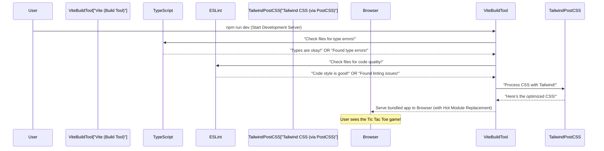

# Chapter 3: Frontend Development & Build Tooling

In the previous chapters, we laid the groundwork for our **SecureFlow** Tic Tac Toe game. In [Chapter 1: React Application UI Components](01_react_application_ui_components_.md), we built the visual parts of our game using React's "LEGO bricks." Then, in [Chapter 2: Game Logic Engine](02_game_logic_engine_.md), we gave our game a "brain" by implementing the rules for winning and drawing.

Now, imagine you've designed a beautiful house (UI components) and installed all the smart systems like plumbing and electricity (game logic). What's next? You need to actually *build* it. This involves making sure all the materials are in the right place, everything is assembled correctly, and the house is polished and ready for someone to move in.

This is exactly what **Frontend Development & Build Tooling** does for our web application! It's the "workshop" and "rulebook" that prepares all our code—our React components, game logic, and styling—so that a web browser can understand it, display it quickly, and run it without errors.

### The Problem: Getting Code Ready for the Browser

The code we write (like `TypeScript` and `React`'s special `JSX` syntax, and `Tailwind CSS`) isn't directly understood by web browsers. Browsers prefer plain `JavaScript`, `HTML`, and `CSS`. Also, we want our game to be:

*   **Fast**: Load quickly for players.
*   **Error-Free**: Catch mistakes before the game even starts.
*   **Consistent**: Look good and behave predictably on different screens.
*   **Easy to Develop**: Make changes and see them instantly.

The problem this chapter addresses is: **How do we efficiently transform our modern, developer-friendly code into a polished, performant website that any browser can run?**

We solve this using a set of powerful tools, each with a specific job in our development workshop.

### Key Concepts: Our Development Workshop Tools

Let's meet the main tools in our `SecureFlow` project's frontend development workshop:

| Tool Name   | Analogy                                  | What it does for SecureFlow                                      |
| :---------- | :--------------------------------------- | :--------------------------------------------------------------- |
| **Vite**    | The Workshop Manager & Builder           | Quickly bundles and prepares all our code for development and production. It's super fast! |
| **TypeScript** | The Strict Blueprint Checker            | Adds strict rules for our code's structure, catching mistakes early. |
| **ESLint**  | The Quality Inspector                    | Checks our code for common mistakes and ensures it follows style guidelines. |
| **Tailwind CSS** | The Pre-made Styling System & Designer | Provides a standardized way to style our game, ensuring a consistent and responsive look. |

Let's dive into each one.

---

### 1. Vite: The Workshop Manager and Builder

Imagine Vite as the main manager of our development workshop. When you're building our Tic Tac Toe game, Vite takes all your different code files (like `.tsx` for React, `.ts` for TypeScript, `.css` for styles) and **bundles** them together into a few optimized files that the browser can easily download and run.

Vite is known for being incredibly fast, especially during development, because it uses modern browser features to update your app instantly as you make changes. This is called "Hot Module Replacement" (HMR).

**How we "tell" Vite what to do**: We have a file named `vite.config.ts`. This is like Vite's instruction manual for how to build our project.

```typescript
// vite.config.ts
import { defineConfig } from 'vite';
import react from '@vitejs/plugin-react'; // Vite needs a plugin to understand React code

// This is Vite's main configuration
export default defineConfig({
  plugins: [react()], // We tell Vite to use the React plugin
  // ... other settings to make Vite work efficiently
});
```

**Explanation**: This simple file tells Vite to use the `react()` plugin. This plugin is crucial because it teaches Vite how to understand and process the special React code (JSX) we write in files like `App.tsx` and `Square.tsx` (from [React Application UI Components](01_react_application_ui_components_.md)).

---

### 2. TypeScript: The Strict Blueprint Checker

Think of TypeScript as a super-smart assistant that checks our blueprints (our code) before we even start building. It adds **strict blueprints** for our code, ensuring fewer errors. JavaScript is very flexible, which can sometimes lead to mistakes that only appear when you run the code. TypeScript helps catch these errors *while you are still writing the code*.

For example, if you expect a piece of data to be a number but accidentally give it text, TypeScript will immediately warn you, saving you from bugs later!

**How TypeScript knows the rules**: We define these rules in `tsconfig.json`, `tsconfig.app.json`, and `tsconfig.node.json`. These are configuration files that tell the TypeScript compiler how to check our code.

```typescript
// tsconfig.app.json (Simplified)
{
  "compilerOptions": {
    "target": "ES2020",         // What version of JavaScript our code will run on
    "jsx": "react-jsx",          // How to handle React's special syntax (JSX)
    "strict": true,              // Enable ALL strict type-checking rules
    "noEmit": true,              // Don't produce JS files, Vite handles that
    // ... other settings for modules and libraries
  },
  "include": ["src"]             // Which files TypeScript should check (our game code)
}
```

**Explanation**: This `tsconfig.app.json` file is for our main application code. It sets rules like `strict: true`, which means TypeScript will be very thorough in checking our code for potential type-related errors. `jsx: "react-jsx"` is important for understanding our React components.

There's also `tsconfig.node.json` for server-side type-checking (like for Vite's own config files) and `tsconfig.json` which links them together. This separation helps TypeScript apply different rules to different parts of the project.

---

### 3. ESLint: The Quality Inspector

ESLint is like a tireless quality inspector who walks through our workshop, checking for common mistakes, code that doesn't follow the agreed-upon style, or potential issues that could lead to bugs. It **checks for common coding mistakes** and ensures everyone writes code in a consistent way.

For instance, ESLint can warn you if you have a variable that you declared but never used, or if you're mixing tabs and spaces in your indentation.

**How ESLint gets its checklist**: We configure ESLint in `eslint.config.js`. This file specifies which rules to follow and which plugins to use.

```typescript
// eslint.config.js (Simplified)
import js from '@eslint/js';
import tseslint from 'typescript-eslint';

export default tseslint.config(
  { ignores: ['dist'] }, // Don't check files that Vite builds into 'dist' folder
  {
    files: ['**/*.{ts,tsx}'], // Apply these rules to our TypeScript and React files
    extends: [
      js.configs.recommended,           // Basic recommended JavaScript rules
      ...tseslint.configs.recommended   // Recommended TypeScript-specific rules
    ],
    rules: {
      // Example: ESLint warns if a React component is not exported by default,
      // which can affect Vite's fast refresh feature during development.
      'react-refresh/only-export-components': 'warn',
      // ... many other rules for code quality and style
    },
  }
);
```

**Explanation**: This configuration tells ESLint to use a set of recommended rules for both regular JavaScript (`js.configs.recommended`) and TypeScript (`tseslint.configs.recommended`). It also includes a specific rule for React (`react-refresh/only-export-components`) that helps ensure our development experience is smooth. If ESLint finds something wrong, it will show a warning or error, helping us fix it right away.

---

### 4. Tailwind CSS: The Pre-made Styling System

Imagine instead of designing every single button or box from scratch, you have a giant box of perfectly designed, flexible LEGO bricks for styling. That's Tailwind CSS! It provides a **pre-made styling system** with utility classes (like `text-xl`, `bg-blue-500`, `p-4`) that you can directly add to your HTML-like tags to style them. This ensures a consistent and responsive look across our Tic Tac Toe game.

**How Tailwind works**: We primarily configure it in `tailwind.config.js` and import it into our main CSS file.

```javascript
// tailwind.config.js
/** @type {import('tailwindcss').Config} */
export default {
  // Tell Tailwind which files to scan for its utility classes
  content: ['./index.html', './src/**/*.{js,ts,jsx,tsx}'],
  theme: {
    extend: {}, // We can add our own custom styles here if needed
  },
  plugins: [],
};
```

```css
/* src/index.css */
@tailwind base;     /* Tailwind's basic styles */
@tailwind components; /* Tailwind's pre-built components (optional) */
@tailwind utilities; /* Tailwind's utility classes (like text-xl, bg-blue-500) */
```

**Explanation**:
1.  `tailwind.config.js`: The `content` array is crucial. It tells Tailwind *where* to look in our project files (`.html`, `.js`, `.ts`, `.jsx`, `.tsx`) for the utility classes we use. Based on this, Tailwind generates only the CSS you actually use, making our final website very small and fast.
2.  `src/index.css`: By importing `@tailwind base;`, `@tailwind components;`, and `@tailwind utilities;`, we tell PostCSS (another tool that processes CSS, often used with Tailwind) to inject Tailwind's styles into our main CSS file.

When you use classes like `className="grid grid-cols-3 gap-2"` on our `Board` component (from [React Application UI Components](01_react_application_ui_components_.md)), Tailwind is responsible for making that 3x3 grid appear correctly.

---

### How to Use Our Build Tools: Building the Game

The beauty of these tools working together is that as a developer, you mostly interact with them through simple commands.

*   **For Development**: When you're actively writing code and want to see your changes instantly in the browser.
    ```bash
    npm run dev
    ```
    This command tells Vite to start a development server. Vite then uses TypeScript, ESLint, and Tailwind to prepare your code, and it provides "Hot Module Replacement" so your browser updates without a full refresh every time you save a file.

*   **For Production**: When you're ready to create the final, highly optimized version of your game to put online.
    ```bash
    npm run build
    ```
    This command also tells Vite to process your code, but this time it focuses on making the output files as small and fast as possible. It minifies JavaScript, optimizes images, and bundles everything for the best performance. The result is a `dist` folder containing all the ready-to-deploy files.

*   **For Quality Check**: To manually run the ESLint quality inspector on all your files.
    ```bash
    npm run lint
    ```
    This command checks your code against all the ESLint rules defined in `eslint.config.js` and reports any warnings or errors.

---

### Under the Hood: The Build Process Workflow

Let's see a simplified step-by-step process of what happens when you run `npm run dev` to start developing our Tic Tac Toe game:



**Explanation of the flow**:
1.  **You start `npm run dev`**: This fires up Vite.
2.  **Vite Orchestrates**: Vite acts as the central hub. It takes your raw code.
3.  **TypeScript Checks**: Vite hands over your TypeScript files to the TypeScript compiler, which checks them against the rules in `tsconfig.app.json` for type safety.
4.  **ESLint Inspects**: At the same time, ESLint scrutinizes your code for style inconsistencies and potential logical errors, based on `eslint.config.js`.
5.  **Tailwind Styles**: Your CSS (specifically `src/index.css`) is processed. Tailwind CSS (via PostCSS) scans your HTML/React files (as configured in `tailwind.config.js`) to find all the utility classes you've used, and then generates only the necessary CSS for them.
6.  **Browser Displays**: Vite then bundles all this checked, processed, and optimized code into a format the browser can understand and serves it. If you make a change, Vite quickly re-runs the necessary steps and updates the browser instantly, thanks to Hot Module Replacement.

---

### Conclusion

In this chapter, we've explored the essential tools that make our `SecureFlow` project's frontend development smooth, fast, and robust. We learned that `Vite` manages the entire build process, `TypeScript` ensures our code follows strict blueprints, `ESLint` acts as a quality inspector, and `Tailwind CSS` provides a powerful, consistent styling system. Together, these tools transform our human-readable source code into a high-performance web application ready for players to enjoy.

Now that we know how to build our application, let's explore how we can automate the process of testing, building, and deploying our game.

[Next Chapter: Automated CI/CD Pipeline](04_automated_ci_cd_pipeline_.md)

---