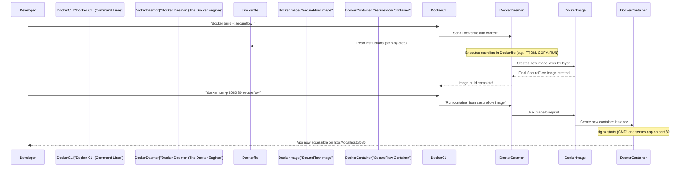

# Chapter 5: Docker Containerization

In the previous chapter, [Automated CI/CD Pipeline](04_automated_ci_cd_pipeline_.md), we learned how to set up an automated factory (our CI/CD pipeline) that tests, checks, and builds our **SecureFlow** Tic Tac Toe game every time we make changes. The `npm run build` command (from [Frontend Development & Build Tooling](03_frontend_development___build_tooling_.md)) produces a shiny, optimized version of our game's website.

Now, imagine you've baked the perfect cake (your built game) in your kitchen. It tastes amazing! But what if you need to deliver this cake to a friend, who lives far away, and you want to be absolutely sure it tastes *exactly* the same when they eat it, no matter what kind of kitchen they have? You wouldn't just hand them the raw ingredients and a recipe, right? You'd package it carefully in a special, insulated box, ready to eat.

This is exactly the problem **Docker Containerization** solves for our application!

### The Perfect Delivery Box: What Problem It Solves

Our Tic Tac Toe game needs to run in different places: on a developer's computer, on a testing server, and eventually on a live production server. Each of these environments might have slightly different operating systems, different versions of Node.js, or other software installed. This can lead to the dreaded "it works on my machine!" problem, where the application behaves differently or even breaks when moved to another environment.

The problem **Docker Containerization** addresses is: **How can we package our entire application (code, dependencies, and everything it needs to run) into a single, portable, and self-contained unit that runs consistently and reliably everywhere, regardless of the underlying environment?**

Docker provides us with a solution: "containers." Think of a container as that perfectly sealed delivery box for our cake. Inside the box, we put our game, all the specific tools it needs (like a web server to display it), and the instructions on how to run it. This way, wherever the box goes, the cake (our game) is always served exactly the same way.

### Key Concepts: Our Packaging Process

Let's look at the key concepts that make up our Docker packaging system:

| Concept Name    | Analogy                                   | What it does for SecureFlow                                     |
| :-------------- | :---------------------------------------- | :-------------------------------------------------------------- |
| **Docker**      | The "Packaging Machine"                   | The technology that builds, ships, and runs our containers.     |
| **Container**   | The "Sealed Delivery Box"                 | A lightweight, portable, self-contained package that runs our app. |
| **Image**       | The "Blueprint/Template" for a Box        | A read-only template that contains our app and all its dependencies. Containers are *created* from images. |
| **Dockerfile**  | The "Recipe Card" for the Image           | A text file with step-by-step instructions for building a Docker image. |
| **Nginx**       | The "Mini Web Server" inside the Box      | A piece of software included in our container that delivers our website files (HTML, CSS, JS) to anyone who visits our game's URL. |

---

### Our Recipe Card: The `Dockerfile`

The `Dockerfile` is the most important part. It's like a detailed recipe that tells Docker exactly how to build our application's "image" (the blueprint for our delivery box). Once we have the image, we can create many "containers" (actual delivery boxes) from it.

Let's break down our `Dockerfile` step by step. It uses a clever technique called a "multi-stage build" which is like having two separate kitchens for different parts of our recipe.

```dockerfile
# Dockerfile

# --- Stage 1: Build our React Application ---
FROM node:20-alpine AS build # 1. Start with a Node.js kitchen (environment)
WORKDIR /app                 # 2. Go inside the /app folder in our kitchen
COPY package*.json ./        # 3. Copy our recipe list (package.json)
RUN npm ci                   # 4. Install all ingredients (dependencies)
COPY . .                     # 5. Copy all our game's source code
RUN npm run build            # 6. Bake the cake (build the frontend app)

# --- Stage 2: Package the Baked Cake with Nginx ---
FROM nginx:alpine            # 7. Start with a tiny Nginx serving kitchen
COPY --from=build /app/dist /usr/share/nginx/html # 8. Take the baked cake from Stage 1 and put it here
# COPY nginx.conf /etc/nginx/conf.d/default.conf  # (Optional) Add special serving instructions
EXPOSE 80                    # 9. Tell the box: "I serve on port 80!"
CMD ["nginx", "-g", "daemon off;"] # 10. Start the Nginx waiter when the box opens
```

**Explanation**:

1.  **`FROM node:20-alpine AS build`**: This line starts our first "kitchen" or "stage" and names it `build`. We pick `node:20-alpine` as our base. This is a small, efficient Linux environment with Node.js version 20 pre-installed, perfect for building our React application.
2.  **`WORKDIR /app`**: Inside this build kitchen, we tell Docker to do all subsequent work in a directory called `/app`.
3.  **`COPY package*.json ./`**: We copy the `package.json` and `package-lock.json` files from our project into the `/app` directory in the container. These files list all our project's dependencies (ingredients).
4.  **`RUN npm ci`**: This command installs all the listed dependencies. It's like gathering all our ingredients for baking.
5.  **`COPY . .`**: Now, we copy *all* our game's source code files (the entire project) into the `/app` directory.
6.  **`RUN npm run build`**: This is where `Vite` (from [Frontend Development & Build Tooling](03_frontend_development___build_tooling_.md)) does its magic. It takes our source code, TypeScript, React, and Tailwind CSS, and builds the final, optimized HTML, CSS, and JavaScript files. These ready-to-serve files are placed in a folder called `dist`.

    ---

7.  **`FROM nginx:alpine`**: This line starts our second, completely separate "kitchen" or "stage." This new stage uses `nginx:alpine` as its base. Nginx is a very popular, lightweight web server. This stage is much smaller because it *only* needs Nginx and our final built game, not Node.js or all our development tools.
8.  **`COPY --from=build /app/dist /usr/share/nginx/html`**: This is the crucial step of the "multi-stage build"! It tells Docker: "Go to the `build` stage (our first kitchen), find the `dist` folder (our baked cake), and copy its contents into the Nginx server's default web directory (`/usr/share/nginx/html`) in this *new* stage." This means our final container only contains Nginx and the optimized `dist` files, keeping it small and secure.
9.  **`EXPOSE 80`**: This declares that the container will listen for network connections on port 80 (the standard port for web traffic). It's like putting a "Here I am! Come visit on port 80!" sign on our delivery box.
10. **`CMD ["nginx", "-g", "daemon off;"]`**: This is the command that runs automatically when a container starts from this image. It starts the Nginx web server, which will then serve our Tic Tac Toe game. It's like the "open the box and serve the cake" instruction.

### The Exclusion List: `.dockerignore`

Just like when you pack a real box, you don't want to include unnecessary things. The `.dockerignore` file tells Docker which files and folders to *ignore* when copying files into the container. This keeps our images small and secure.

```
# .dockerignore

node_modules      # Don't copy all the development dependencies
npm-debug.log
.git              # Don't need Git history inside the container
.github           # Don't need GitHub Actions workflow files
.gitignore
README.md
.vscode           # Don't need editor configuration
*.md              # Ignore other Markdown files
*.log
.env              # Keep environment variables out for security
.env.local
.env.development.local
.env.test.local
.env.production.local
kubernetes        # Don't need Kubernetes configuration files here
```

**Explanation**: This file prevents Docker from copying large or sensitive files (like `node_modules`, `.git` folders, or `.env` files) into the Docker image. This is vital for security and keeping our container images as small and efficient as possible.

---

### Under the Hood: Building and Running Our Container

Let's trace what happens when we use Docker to build our game's image and then run a container.



**Explanation of the flow**:

1.  **You type `docker build -t secureflow .`**: You tell the Docker Command Line Interface (CLI) to build an image. `-t secureflow` gives our image a name (`secureflow`), and `.` means "look for the Dockerfile in the current directory."
2.  **Docker CLI talks to Docker Daemon**: The CLI sends your command and the `Dockerfile` to the Docker Daemon, which is the "engine" that does all the heavy lifting.
3.  **Daemon reads `Dockerfile`**: The Docker Daemon reads the `Dockerfile` line by line.
4.  **Building layers**: For each instruction (like `FROM`, `COPY`, `RUN`), Docker performs the action and creates a new "layer" in the image. This layering makes images efficient.
5.  **Image creation**: After all instructions are executed, the Docker Daemon finishes building the `secureflow` image.
6.  **You type `docker run -p 8080:80 secureflow`**: You tell Docker to create and run a container from the `secureflow` image. `-p 8080:80` is important: it maps port 8080 on your *local machine* to port 80 *inside the container*. This lets you access the app in your browser.
7.  **Container starts**: Docker uses the `secureflow` image as a blueprint and starts a new, isolated container. Inside this container, the `CMD` instruction from the `Dockerfile` automatically runs `nginx`, which then serves our Tic Tac Toe game.
8.  **Access the app**: Because of the port mapping, you can now open your web browser and go to `http://localhost:8080` to play the game! The game is running inside the Docker container, completely isolated from your computer's other software.

### How `SecureFlow` Uses Docker

In our [Automated CI/CD Pipeline](04_automated_ci_cd_pipeline_.md), the `docker` job uses these same Docker commands. Instead of you typing them, GitHub Actions runs them automatically:

1.  It executes `docker build` to create a new `secureflow` image containing the latest version of our game.
2.  It uses `Trivy` to scan this image for security vulnerabilities.
3.  If the scan passes, it "tags" the image (like putting a version sticker on the box) and then pushes it to a central **Container Registry** (like a warehouse for Docker images, `ghcr.io` in our case).

This entire process ensures that a ready-to-deploy, secure, and consistently packaged version of our game is always available, ready to be picked up by our deployment system.

---

### Conclusion

In this chapter, we've learned about **Docker Containerization** and how it provides a powerful solution for packaging our **SecureFlow** Tic Tac Toe game. We explored how the `Dockerfile` acts as a recipe to build a portable "image" containing our game and its web server (Nginx). We then saw how this image can be used to create "containers" that run our game consistently in any environment. This reliable packaging is a crucial step towards easily deploying our application to the cloud.

Now that our game is neatly packaged in a Docker container, the next step is to efficiently manage and run these containers on many servers, especially as our game grows.

[Next Chapter: Kubernetes Deployment & Orchestration](06_kubernetes_deployment___orchestration_.md)

---