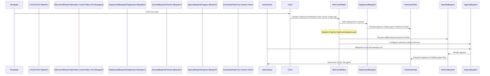

# Chapter 6: Kubernetes Deployment & Orchestration

In the previous chapter, [Docker Containerization](05_docker_containerization_.md), we learned how to package our **SecureFlow** Tic Tac Toe game into a neat, portable "delivery box" called a Docker container. This container includes our game code, its web server (Nginx), and everything else it needs to run consistently.

Now, imagine you have a warehouse full of these perfectly packaged game boxes. You don't just have one; you might need hundreds or thousands to handle many players! And you need someone to manage this huge warehouse: ensuring there are always enough boxes, replacing any damaged ones automatically, giving each box a stable address, and making sure external visitors can find the right box when they come to play.

This is exactly what **Kubernetes Deployment & Orchestration** does for our application! If Docker provides the individual shipping containers, Kubernetes is the advanced, automated shipping yard manager. It's the brain that intelligently runs, scales, and manages our Docker containers in a cloud environment.

### The Automated Shipping Yard Manager: What Problem It Solves

Our Tic Tac Toe game needs to be:
*   **Highly Available**: Always running, even if one server or game instance crashes.
*   **Scalable**: Easily run more copies of the game when many players join, and fewer when traffic is low.
*   **Discoverable**: Players need a stable, unchanging address to find our game, even if the actual game instances (containers) are constantly starting, stopping, or moving.
*   **Accessible**: Allow external internet traffic to reach our game.

Doing all this manually for many game instances would be a nightmare! The problem **Kubernetes Deployment & Orchestration** solves is: **How do we efficiently run and manage many copies of our packaged application, keeping them healthy, available, and accessible to players around the world, all automatically?**

Kubernetes provides an elegant solution by giving us special "blueprints" to describe how our application should behave.

### Key Concepts: Our Shipping Yard Blueprints

Kubernetes uses declarative configuration files (written in YAML) as its blueprints. We describe the *desired state* (e.g., "I want 3 copies of my game running"), and Kubernetes works tirelessly to make that happen.

Here are the main blueprints we use for `SecureFlow`:

| Blueprint Name    | Analogy                                   | What it does for SecureFlow                                     |
| :---------------- | :---------------------------------------- | :-------------------------------------------------------------- |
| **`Deployment`**  | The "Worker Manager Blueprint"            | Defines *how many copies* of our game container should run and how to keep them healthy. |
| **`Service`**     | The "Internal Mailbox Blueprint"          | Provides a *stable internal address* for our game within the Kubernetes cluster. |
| **`Ingress`**     | The "Front Gate Blueprint"                | Acts as the *gateway*, allowing external internet traffic (from a domain name) to reach our running game. |

---

### 1. `Deployment`: The Worker Manager Blueprint

The `Deployment` blueprint tells Kubernetes about our application's "workers" (our Docker containers). It answers questions like: "What is the name of our game container?", "How many copies should be running at all times?", and "How do you check if a game instance is healthy?".

This is defined in `kubernetes/deployment.yaml`.

```yaml
# kubernetes/deployment.yaml (Simplified)
apiVersion: apps/v1
kind: Deployment
metadata:
  name: tic-tac-toe # Name of our application
  labels:
    app: tic-tac-toe
spec:
  replicas: 3 # We want 3 copies of our game running
  selector:
    matchLabels:
      app: tic-tac-toe
  template:
    metadata:
      labels:
        app: tic-tac-toe
    spec:
      containers:
      - name: tic-tac-toe
        image: ghcr.io/your-org/secureflow:sha-XYZ # Our Docker image (updated by CI/CD!)
        ports:
        - containerPort: 80 # Our game listens on port 80 inside the container
        livenessProbe: # Check if the app is still alive
          httpGet:
            path: /
            port: 80
        readinessProbe: # Check if the app is ready to receive traffic
          httpGet:
            path: /
            port: 80
```

**Explanation**:
*   **`name: tic-tac-toe`**: This is the unique name for our Deployment.
*   **`replicas: 3`**: This is powerful! It tells Kubernetes to *always* try to keep 3 copies of our game running. If one crashes, Kubernetes automatically starts a new one to replace it. If we need more, we can simply change this number (e.g., to `5`) and Kubernetes will scale up!
*   **`image: ghcr.io/your-org/secureflow:sha-XYZ`**: This is the Docker image we built and pushed to our registry in [Docker Containerization](05_docker_containerization_.md). The `sha-XYZ` part is automatically updated by our [Automated CI/CD Pipeline](04_automated_ci_cd_pipeline_.md) with the latest version of our game.
*   **`ports: - containerPort: 80`**: Our Nginx web server inside the Docker container listens on port 80.
*   **`livenessProbe` & `readinessProbe`**: These are "health checks." Kubernetes uses these to frequently check if our game instances are truly alive and ready to serve players. If a check fails, Kubernetes knows to restart the faulty instance or temporarily stop sending traffic to it.

---

### 2. `Service`: The Internal Mailbox Blueprint

While our `Deployment` manages individual game instances (called "Pods" in Kubernetes, which are essentially wrappers around our Docker containers), these Pods are temporary. They can be replaced, and their internal IP addresses change. Players need a stable way to reach the game.

The `Service` blueprint solves this by giving our `Deployment` a stable, unchanging internal IP address and DNS name *within* the Kubernetes cluster. It's like an internal extension number that always connects you to a healthy game instance, no matter which specific Pod is running.

This is defined in `kubernetes/service.yaml`.

```yaml
# kubernetes/service.yaml (Simplified)
apiVersion: v1
kind: Service
metadata:
  name: tic-tac-toe # Name of our Service
  labels:
    app: tic-tac-toe
spec:
  type: ClusterIP # Internal-only IP address
  ports:
  - port: 80       # Port the Service listens on
    targetPort: 80 # Port on the Pods it forwards to
    protocol: TCP
    name: http
  selector:
    app: tic-tac-toe # Link this Service to Pods labeled 'app: tic-tac-toe'
```

**Explanation**:
*   **`name: tic-tac-toe`**: This Service is named the same as our Deployment for clarity.
*   **`type: ClusterIP`**: This means the Service is only accessible from *inside* the Kubernetes cluster. It provides that stable internal IP.
*   **`ports: - port: 80 targetPort: 80`**: The Service listens on port 80 and forwards traffic to port 80 on any Pod it manages.
*   **`selector: app: tic-tac-toe`**: This is the magic link! The Service looks for *any* Pods that have the label `app: tic-tac-toe` (which our Deployment adds to its Pods). It then automatically balances traffic across all healthy Pods that match this label.

---

### 3. `Ingress`: The Front Gate Blueprint

Our `Deployment` gets our game running, and our `Service` gives it a stable internal address. But how do players on the internet reach it from a public web address like `tic-tac-toe.example.com`? That's where `Ingress` comes in.

The `Ingress` blueprint acts as the "front gate" to our Kubernetes cluster. It's responsible for routing outside internet traffic, based on domain names and paths, to the correct internal `Service`.

This is defined in `kubernetes/ingress.yaml`.

```yaml
# kubernetes/ingress.yaml (Simplified)
apiVersion: networking.k8s.io/v1
kind: Ingress
metadata:
  name: tic-tac-toe-ingress # Name for our Ingress rule
  annotations:
    kubernetes.io/ingress.class: nginx # We're using an Nginx Ingress controller
spec:
  rules:
  - host: tic-tac-toe.example.com # Our game's public domain name
    http:
      paths:
      - path: /        # Route requests for the root path
        pathType: Prefix
        backend:
          service:
            name: tic-tac-toe # Send traffic to our Service
            port:
              number: 80 # On port 80 of the Service
```

**Explanation**:
*   **`name: tic-tac-toe-ingress`**: A unique name for our Ingress configuration.
*   **`host: tic-tac-toe.example.com`**: This tells Ingress: "If someone visits `tic-tac-toe.example.com` (replace with your actual domain), listen up!"
*   **`path: /`**: This means "for any request to the root of that domain (e.g., `tic-tac-toe.example.com/` or `tic-tac-toe.example.com/anything`),"
*   **`backend.service.name: tic-tac-toe`**: "...send that traffic to our `tic-tac-toe` Service, which we defined earlier!"
*   **`port.number: 80`**: "...on port 80 of that Service."

This effectively creates a public doorway for our game, directing all traffic for `tic-tac-toe.example.com` to the stable `Service`, which then routes it to a healthy game `Pod`.

---

### How SecureFlow Uses Kubernetes: The Deployment Process

Remember in [Automated CI/CD Pipeline](04_automated_ci_cd_pipeline_.md) how the last job (`update-k8s`) committed a change to `kubernetes/deployment.yaml` with the new Docker image tag? That's the starting signal!

Here's the simplified flow of how our game gets deployed and managed by Kubernetes:

1.  **Code Change & CI/CD**: A developer pushes new game code. Our [Automated CI/CD Pipeline](04_automated_ci_cd_pipeline_.md) tests, builds, and containers (via [Docker Containerization](05_docker_containerization_.md)) the new version.
2.  **Deployment Update**: The CI/CD pipeline then updates the `image` field in `kubernetes/deployment.yaml` with the new, freshly built Docker image tag (e.g., `sha-8c018db8df6edc7a0092e6137392d585b75a8af7`). It commits and pushes this change to the GitHub repository.
3.  **Kubernetes Sees Change**: An operator or an automated tool detects this change (or you manually apply the YAML files using `kubectl apply -f kubernetes/deployment.yaml`).
4.  **Orchestration**: The Kubernetes "manager" (called the Control Plane) reads our `Deployment`, `Service`, and `Ingress` blueprints.

    *   It ensures the `Deployment` runs the specified number of `Pods` using our new Docker image. It gracefully replaces old Pods with new ones, ensuring no downtime.
    *   It ensures the `Service` provides a stable internal network address for these Pods.
    *   It ensures the `Ingress` routes external requests from our chosen domain to this stable `Service`.

Now, the game is live, scaled, and accessible!

#### Under the Hood: Kubernetes Orchestration

Let's look at the simplified journey of our game from code to being live and accessible:



**Explanation of the flow**:
1.  **Developer kicks off**: A new code version is pushed.
2.  **CI/CD prepares**: The pipeline builds the Docker image and updates the `Deployment` blueprint with the new image.
3.  **Kubernetes takes over**: The `Kubernetes Control Plane` (the brain of Kubernetes) sees the updated `Deployment` blueprint.
4.  **Deployment acts**: The `Deployment` component, managed by Kubernetes, takes responsibility for creating or updating `Pods` (our running game containers) to match the new image and desired `replicas` count.
5.  **Service & Ingress expose**: The `Service` and `Ingress` blueprints ensure that once the `Pods` are running, they are internally discoverable and externally accessible through a stable domain name.
6.  **User plays**: An `Internet User` makes a request to the game's public domain. The `Ingress` routes it to the `Service`, which picks a healthy `Pod` to serve the game.

This powerful system ensures our `SecureFlow` Tic Tac Toe game is always running, automatically scales, heals itself from failures, and is accessible to players efficiently.

---

### Conclusion

In this chapter, we've completed our journey from code to cloud! We learned how **Kubernetes Deployment & Orchestration** acts as the automated shipping yard manager for our Docker containers. We explored how `deployment.yaml` defines how many copies of our game should run and how to keep them healthy, `service.yaml` provides a stable internal address, and `ingress.yaml` acts as the gateway for external internet traffic. Together, these Kubernetes components ensure our `SecureFlow` Tic Tac Toe game is highly available, scalable, and easily accessible to players worldwide.

---